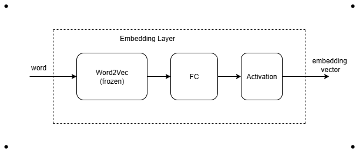
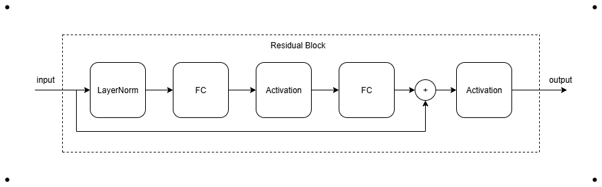
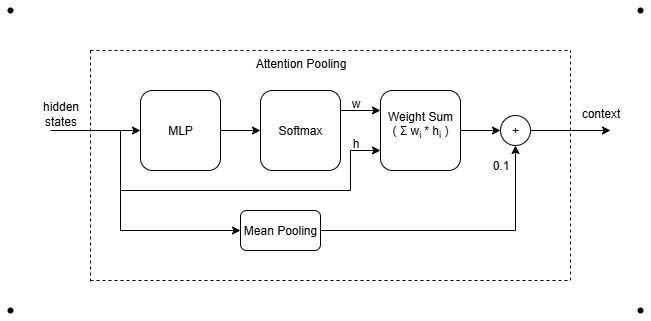
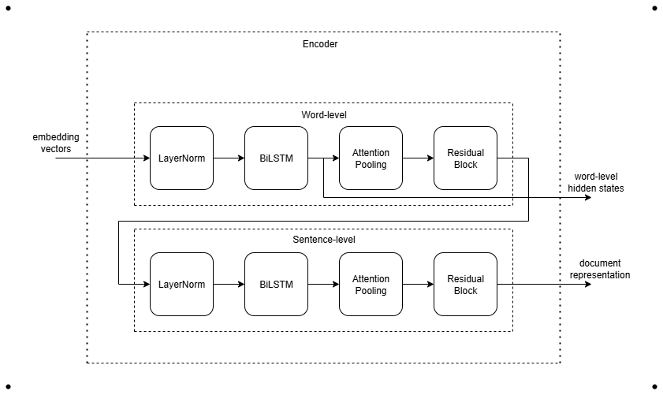
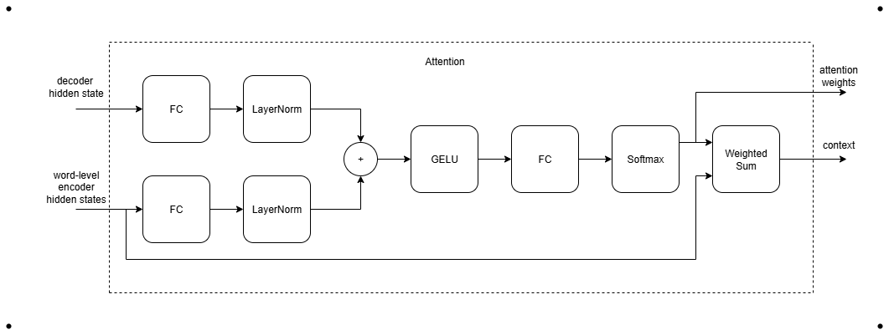
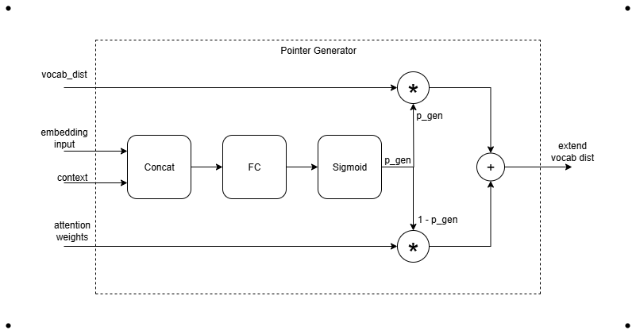
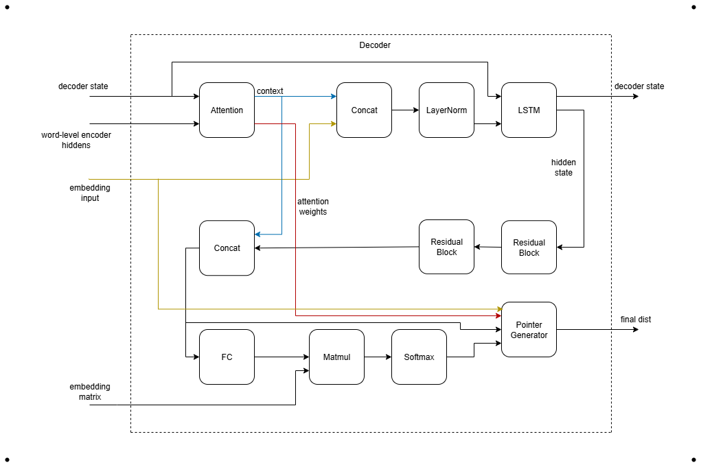
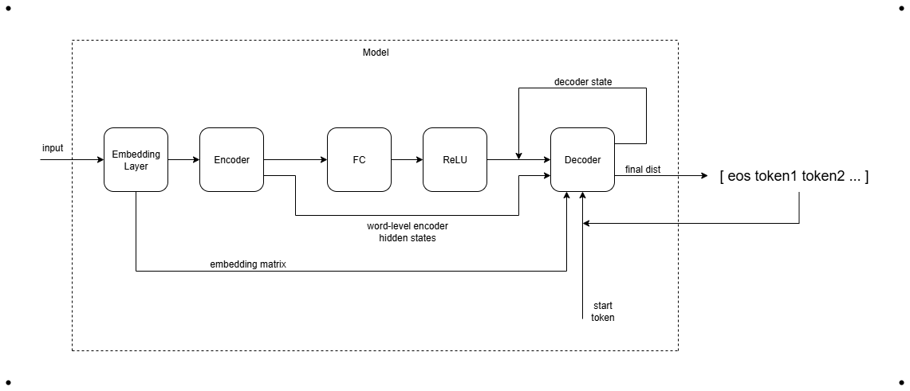

# Vietnamese Text Summarization

## Introduction

This projects provides a Vietnamese Text Summarization model that can take a long text and create a short summary that presents the main idea quickly, especially for online news.

## Dataset

This project uses the VNDS (Vietnamese News Dataset), a large collection of Vietnamese news articles and summaries. It covers multiple domains including politics, economy, technology, and lifestyle, making it suitable for training and evaluating text summarization models.

The dataset is structured as follows:
- guid: Unique ID for each article.
- title: The title of the news article.
- abstract: The summary of the news article, used as ground-truth for training and evaluation.
- article: Full text of the news article, used as input for the model.

Example:

- guid: 1
- title: 
```text
Bản_án cho đối_tượng giả_danh công_an để lừa_đảo
```
- abstract: 
```text
Ngày 25/2 , TAND TP. Đà_Nẵng tuyên_phạt Hồ_Xuân_Huy ( SN 1994 ) , ngụ quận Hải_Châu , 12 năm tù về tội Lừa_đảo chiếm_đoạt tài_sản .
```

- article: 
```text
Theo lời khai của Huy tại phiên_toà , để có tiền sử_dụng cá_nhân , Huy "" nổ "" là sĩ_quan cục Phòng_chống ma_tuý của bộ Công_an đóng tại TP. Đà_Nẵng , có nguồn mua ô_tô thanh_lý giá rẻ , và khả_năng chạy việc vào ngành công_an . Chỉ với lời "" nổ "" này , từ tháng 10/2016 đến 9/2017 , nhiều người đã bị lừa_đảo với tổng_số tiền 3,2 tỷ đồng . Trong đó , người bị Huy lừa nhiều nhất là vợ_chồng ông Bảo_Th . , ngụ quận Hải_Châu . Huy giới_thiệu với cặp vợ_chồng này mình có suất mua ô_tô thanh_lý giá rẻ và rủ họ mua cùng . Tin lời , vợ_chồng ông Th . đưa cho Huy hơn 1 tỷ đồng . Cùng thủ_đoạn , Huy lừa thêm ông Nguyễn_Tấn_T. 970 triệu đồng , Lê_Quốc_Th . 400 triệu đồng , Trần_Nhật_S. 300 triệu đồng … Sau chiêu_thức mua xe thanh_lý , Huy chuyển sang giả_vờ có khả_năng xin việc vào ngành công_an . Với chiêu_thức này , Huy lừa vợ_chồng ông Đinh_Ngọc_H. 250 triệu đồng . Ngoài_ra , Huy hứa_hẹn , tháng 3/2017 sẽ đưa kết_quả cho con ông H. đi làm_việc . Tuy_nhiên , sau nhiều lần hẹn mà không có quyết_định tuyển_dụng , ông H. đã gửi đơn tố_cáo đến cơ_quan Công_an . Từ đó , những hành_vi sai_trái của Huy lần_lượt được truy ra .  Huy tại phiên_toà .
```

For this project, the dataset was preprocessed by:
- Cleaning text: removing unnecessary special characters, extra spaces
- Lowercasing and normalizing punctuation
- Replacing certain words such as numbers, dates, or other specific tokens with special placeholder tokens

Example of cleaning:

- Original:
```text
Ngày 25/2 , TAND TP. Đà_Nẵng tuyên_phạt Hồ_Xuân_Huy ( SN 1994 ) , ngụ quận Hải_Châu , 12 năm tù về tội Lừa_đảo chiếm_đoạt tài_sản .
```
- Cleaned:
```text
ngày <DATE> , tand tp . đà_nẵng tuyên_phạt <UNK> ( sn <NUM> ) , ngụ quận <UNK>, <NUM> năm tù về tội lừa_đảo chiếm_đoạt tài_sản .
```

## Model Architecture

The model is designed with the following components:

1. Embedding Layer
    - Trained Skip-gram Word2Vec on the dataset.
    - Embeddings are frozen during training.
    - Passed through a fully connected layer with activation to enhance representation.
<p align="center">

</p>

2. Residual Block
    - Projects input through two fully connected layers with activation.
    - Uses skip connection to preserve information.
    - Final output is passed through an activation function.
<p align="center">
  
</p>

3. Attention Pooling
    - Computes attention scores for each token.
    - Converts scores into weights with softmax.
    - Produces a weighted sum of token representations (context vector).
    - Adds a small mean pooling term for stability.
<p align="center">
  
</p>

4. Hierarchical Encoder

    The encoder captures information at both the word-level and the sentence-level to build document representations.

    - Word-level encoding
        - Embedding vectors are passed through a BiLSTM to capture information.
        - The outputs are aggregated using Attention Pooling to obtain a context vector representing the entire sentence.
        - Residual blocks further refine this context vector, enriching the representation while preserving important features.
    - Sentence-level encoding
        - Sentence representations are then passed through another BiLSTM to capture relationships across sentences in document.
        - Attention Pooling aggregates them into a document-level context vector.
        - Residual blocks further enhance this document representation.

<p align="center">
  
</p>

5. Attention

    - Uses the decoder's current hidden state to focus on the most relevant word-level encoder hidden state at each decoding step.
    - Produces a context vector that guides the decoder using attention weights.

<p align="center">
  
</p>

6. Pointer Generator

    - Lets model choose between generating new words and copying from the source.
    - Ensures important source words can appear even if not in the vocab.
    
<p align="center">
  
</p>

7. Decoder

    - Uses the previous hidden state to attend over word-level encoder hidden states, extracting a context vector.
    - Concatenates the context with the current input embedding, passing through an LSTM to update the decoder state.
    - The updated state is enriched by residual blocks for better representation.
    - Concatenates the decoder state with the context vector to compute the vocabulary distribution, reusing the embedding matrix (weight tying) to reduce parameters.
    - Finally, combines vocab distribution, context, attention weights in the Pointer Generator to produce the final token distribution.

<p align="center">
  
</p>

Overall Architecture

The overall model integrates all the above components into a pipeline:
- Input tokens are first processed by the Embedding Layer.
- The resulting embeddings are fed into Encoder, which produces both the document representation and word-level encoder hidden states.
- The document representation is then passed through a fully connected layer with activation ReLU to match the decoder's input space.
- Finally, the Decoder generates tokens step by step, leveraging attention over the word-level hidden states, and produces the final token distribution through the Pointer-Generator mechanism.
<p align="center">
  
</p>

## Results on Test Set

The model was evaluated on the test set using ROUGE metrics, which measure the overlap between the generated summaries and the reference summaries.

| Metric   | ROUGE-1 | ROUGE-2 | ROUGE-L |
|----------|---------|---------|---------|
| Precision | 0.6432  | 0.3121  | 0.5834  |
| Recall    | 0.6125  | 0.3054  | 0.5652  |
| F1-Score  | 0.6273  | 0.3087  | 0.5742  |

Notes:

- ROUGE-1: unigram overlap between generated and reference summaries.
- ROUGE-2: bigram overlap.
- ROUGE-L: longest common subsequence, capturing sentence-level structure.